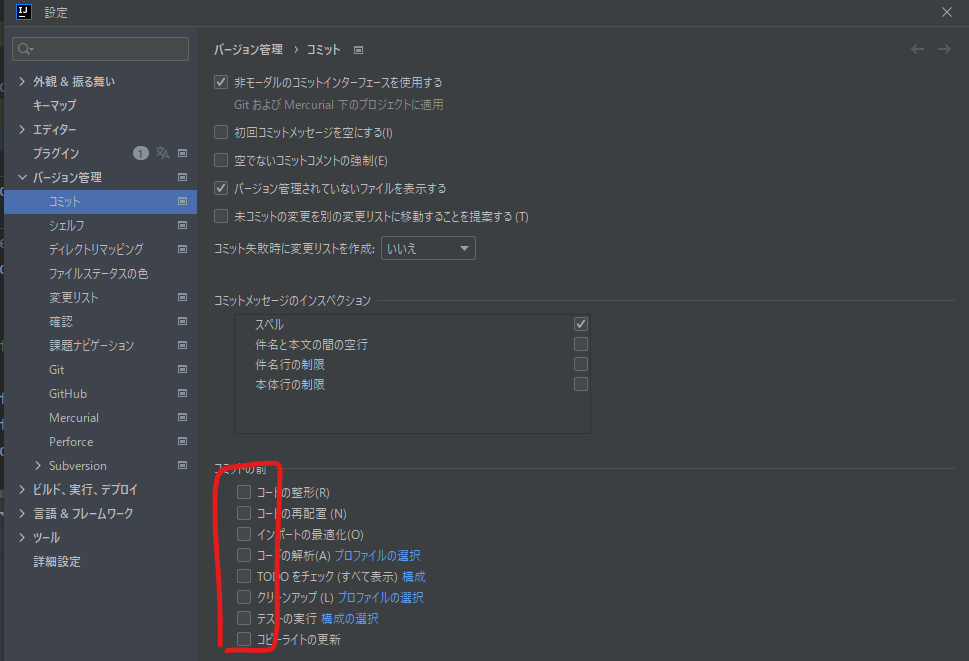

# ビルド関連メモ

## bungeecordの自動テストが通らない件

`docker-compose build` する際にbungeecordコンテナで `mvn clean install` して必要なモジュールを
mvnから取ってきて自動テストまでしてくれるが、google.Jsonみたいなモジュールの自動テストが通らない。

```
#0 76.68
#0 76.68 -------------------------------------------------------
#0 76.68  T E S T S
#0 76.68 -------------------------------------------------------
#0 76.96 Running com.imaginarycode.minecraft.redisbungee.test.RedisUtilTest
#0 77.02 Tests run: 1, Failures: 0, Errors: 0, Skipped: 0, Time elapsed: 0.042 sec
#0 77.04 Running com.imaginarycode.minecraft.redisbungee.test.UUIDNameTest
#0 78.29 Current UUID for name vemacs is 964cfdcd-ce9b-41c9-a79f-6b51a70ae7b9
#0 78.76 Tests run: 2, Failures: 0, Errors: 1, Skipped: 0, Time elapsed: 1.726 sec <<< FAILURE!
#0 78.76 testUuidToName(com.imaginarycode.minecraft.redisbungee.test.UUIDNameTest)  Time elapsed: 0.475 sec  <<< ERROR!
#0 78.76 com.google.gson.JsonSyntaxException: java.lang.IllegalStateException: Expected BEGIN_ARRAY but was BEGIN_OBJECT at line 1 column 2 path $
#0 78.76        at com.google.gson.Gson.fromJson(Gson.java:899)
#0 78.76        at com.google.gson.Gson.fromJson(Gson.java:852)
#0 78.76        at com.google.gson.Gson.fromJson(Gson.java:801)
#0 78.76        at com.imaginarycode.minecraft.redisbungee.util.uuid.NameFetcher.nameHistoryFromUuid(NameFetcher.java:32)
#0 78.76        at com.imaginarycode.minecraft.redisbungee.test.UUIDNameTest.testUuidToName(UUIDNameTest.java:23)
#0 78.76        at sun.reflect.NativeMethodAccessorImpl.invoke0(Native Method)
#0 78.76        at sun.reflect.NativeMethodAccessorImpl.invoke(NativeMethodAccessorImpl.java:62)
#0 78.76        at sun.reflect.DelegatingMethodAccessorImpl.invoke(DelegatingMethodAccessorImpl.java:43)
#0 78.76        at java.lang.reflect.Method.invoke(Method.java:498)
#0 78.76        at org.junit.runners.model.FrameworkMethod$1.runReflectiveCall(FrameworkMethod.java:47)
#0 78.76        at org.junit.internal.runners.model.ReflectiveCallable.run(ReflectiveCallable.java:12)
#0 78.76        at org.junit.runners.model.FrameworkMethod.invokeExplosively(FrameworkMethod.java:44)
#0 78.76        at org.junit.internal.runners.statements.InvokeMethod.evaluate(InvokeMethod.java:17)
#0 78.76        at org.junit.runners.ParentRunner.runLeaf(ParentRunner.java:271)
#0 78.76        at org.junit.runners.BlockJUnit4ClassRunner.runChild(BlockJUnit4ClassRunner.java:70)
#0 78.76        at org.junit.runners.BlockJUnit4ClassRunner.runChild(BlockJUnit4ClassRunner.java:50)
#0 78.76        at org.junit.runners.ParentRunner$3.run(ParentRunner.java:238)
#0 78.76        at org.junit.runners.ParentRunner$1.schedule(ParentRunner.java:63)
#0 78.76        at org.junit.runners.ParentRunner.runChildren(ParentRunner.java:236)
#0 78.76        at org.junit.runners.ParentRunner.access$000(ParentRunner.java:53)
#0 78.76        at org.junit.runners.ParentRunner$2.evaluate(ParentRunner.java:229)
#0 78.76        at org.junit.runners.ParentRunner.run(ParentRunner.java:309)
#0 78.76        at org.apache.maven.surefire.junit4.JUnit4Provider.execute(JUnit4Provider.java:252)
#0 78.76        at org.apache.maven.surefire.junit4.JUnit4Provider.executeTestSet(JUnit4Provider.java:141)
#0 78.76        at org.apache.maven.surefire.junit4.JUnit4Provider.invoke(JUnit4Provider.java:112)
#0 78.76        at sun.reflect.NativeMethodAccessorImpl.invoke0(Native Method)
#0 78.76        at sun.reflect.NativeMethodAccessorImpl.invoke(NativeMethodAccessorImpl.java:62)
#0 78.76        at sun.reflect.DelegatingMethodAccessorImpl.invoke(DelegatingMethodAccessorImpl.java:43)
#0 78.76        at java.lang.reflect.Method.invoke(Method.java:498)
#0 78.76        at org.apache.maven.surefire.util.ReflectionUtils.invokeMethodWithArray(ReflectionUtils.java:189)
#0 78.76        at org.apache.maven.surefire.booter.ProviderFactory$ProviderProxy.invoke(ProviderFactory.java:165)
#0 78.76        at org.apache.maven.surefire.booter.ProviderFactory.invokeProvider(ProviderFactory.java:85)
#0 78.76        at org.apache.maven.surefire.booter.ForkedBooter.runSuitesInProcess(ForkedBooter.java:115)
#0 78.76        at org.apache.maven.surefire.booter.ForkedBooter.main(ForkedBooter.java:75)
#0 78.76 Caused by: java.lang.IllegalStateException: Expected BEGIN_ARRAY but was BEGIN_OBJECT at line 1 column 2 path $
#0 78.76        at com.google.gson.stream.JsonReader.beginArray(JsonReader.java:350)
#0 78.76        at com.google.gson.internal.bind.CollectionTypeAdapterFactory$Adapter.read(CollectionTypeAdapterFactory.java:80)
#0 78.76        at com.google.gson.internal.bind.CollectionTypeAdapterFactory$Adapter.read(CollectionTypeAdapterFactory.java:61)
#0 78.76        at com.google.gson.Gson.fromJson(Gson.java:887)
#0 78.76        ... 33 more
#0 78.76
#0 78.77
#0 78.77 Results :
#0 78.77
#0 78.77 Tests in error:
#0 78.77   testUuidToName(com.imaginarycode.minecraft.redisbungee.test.UUIDNameTest): java.lang.IllegalStateException: Expected BEGIN_ARRAY but was BEGIN_OBJECT at line 1 column 2 path $
#0 78.78
#0 78.78 Tests run: 3, Failures: 0, Errors: 1, Skipped: 0
#0 78.78
#0 78.78 [INFO] ------------------------------------------------------------------------
#0 78.78 [INFO] BUILD FAILURE
#0 78.78 [INFO] ------------------------------------------------------------------------
#0 78.78 [INFO] Total time:  01:15 min
#0 78.79 [INFO] Finished at: 2022-10-13T18:41:07Z
#0 78.79 [INFO] ------------------------------------------------------------------------
#0 78.79 [ERROR] Failed to execute goal org.apache.maven.plugins:maven-surefire-plugin:2.12.4:test (default-test) on project RedisBungee: There are test failures.
#0 78.79 [ERROR]
#0 78.79 [ERROR] Please refer to /RedisBungee/target/surefire-reports for the individual test results.
#0 78.80 [ERROR] -> [Help 1]
#0 78.80 [ERROR]
#0 78.80 [ERROR] To see the full stack trace of the errors, re-run Maven with the -e switch.
#0 78.80 [ERROR] Re-run Maven using the -X switch to enable full debug logging.
#0 78.80 [ERROR]
#0 78.80 [ERROR] For more information about the errors and possible solutions, please read the following articles:
#0 78.80 [ERROR] [Help 1] http://cwiki.apache.org/confluence/display/MAVEN/MojoFailureException
```

> JsonのParse Error らしいが、テスト用のjsonデータが悪いんじゃ？？？

埒があかないので、テストをスキップする。他の人はどうしているんだろう。

```diff
RUN git checkout 934e4543d695f1e79f6690ac4ee435e3fa5d50d4
- RUN mvn clean install
+ RUN mvn clean install -DskipTests=true
```

### 原因

redisbungeeのテストにて、以下のMojangAPIを呼び出しuuidからプロファイルにアクセスするテストを行っている。

```java
    public static List<String> nameHistoryFromUuid(UUID uuid) throws IOException {
        String url = "https://api.mojang.com/user/profiles/" + uuid.toString().replace("-", "") + "/names";
```
このAPIは2022/9/13に廃止になっている模様。

see also:
  https://wiki.vg/Mojang_API#UUID_to_Name_History_.28Removed.29
  https://help.minecraft.net/hc/en-us/articles/8969841895693-Username-History-API-Removal-FAQ-

リポジトリ側にissueを投げてもコンテナ側は最新版ではなく特定過去版をチェックアウトしているので意味がない。テストスキップか、folkして問題のテストを削除（もしくは廃止されていないAPIでのチェック）で対応するしかない？

https://discord.com/channels/237758724121427969/959291374350524466/1030775171486842990
>きさらぎ (Igarasi_K) — 2022/10/15
RedisBungeeのMojangAPI問題、.patchを作って問題のメソッドから空のリストを返すようにすると問題がある…？

この方法でなんとかなるかやってみる？

## コードの修正が終わったら

sbtシェルにて、以下のコマンドを実行してフォーマットをしておかないと検証ではねられます。
```scala
assembly; scalafmtAll; scalafixAll;
```

## コンベンショナルコミットのtype情報

https://gist.github.com/brianclements/841ea7bffdb01346392c#type

- build: Changes that affect the build system or external dependencies (example scopes: gulp, broccoli, npm)
- ci: Changes to our CI configuration files and scripts (example scopes: Circle, BrowserStack, SauceLabs)
- docs: Documentation only changes
- feat: A new feature
- fix: A bug fix
- perf: A code change that improves performance
- refactor: A code change that neither fixes a bug nor adds a feature
- style: Changes that do not affect the meaning of the code (white-space, formatting, missing semi-colons, etc)
- test: Adding missing tests or correcting existing tests


## テスト用のワールドを作成する方法

ゲーム内からmultiverseのコマンドを実行すれば良いはずなのだが。
コマンドの実行パーミッションがないと怒られる。

### パーミッション付与方法は？

```sh
docker-compose attach [spigotのコンテナ名]
# 実行するとプロンプトも何も出ないけどコマンド受付状態になる
op [MCID] # この人にオペレータ権限を与える
mv
```

### 作成するワールド名

com/github/unchama/seichiassist/ManagedWorld.scala
```scala
  case object WORLD_2 extends ManagedWorld("world_2", "メインワールド")
  case object WORLD_SW extends ManagedWorld("world_SW", "第一整地ワールド")
  case object WORLD_SW_2 extends ManagedWorld("world_SW_2", "第二整地ワールド")
  case object WORLD_SW_3 extends ManagedWorld("world_SW_3", "第三整地ワールド")
  case object WORLD_SW_4 extends ManagedWorld("world_SW_4", "第四整地ワールド")
  case object WORLD_SW_NETHER extends ManagedWorld("world_SW_nether", "整地ネザー")
  case object WORLD_SW_END extends ManagedWorld("world_SW_the_end", "整地エンド")
```
これだけ押さえておけばよいだろう。

しかしM1 MacのMinecraftクライアントはアンダーバーが入力できんのだよ...

参考：
https://wiki.craftportal.jp/view/%E3%83%97%E3%83%A9%E3%82%B0%E3%82%A4%E3%83%B3%E8%A7%A3%E8%AA%AC:Multiverse-Core

## IDEAのコミット設定
設定>バージョン管理>コミット

コミット前のチェックを全部外しておかないとscalafmt, scalafixに沿わないスタイル修正が自動で行われてしまう。

